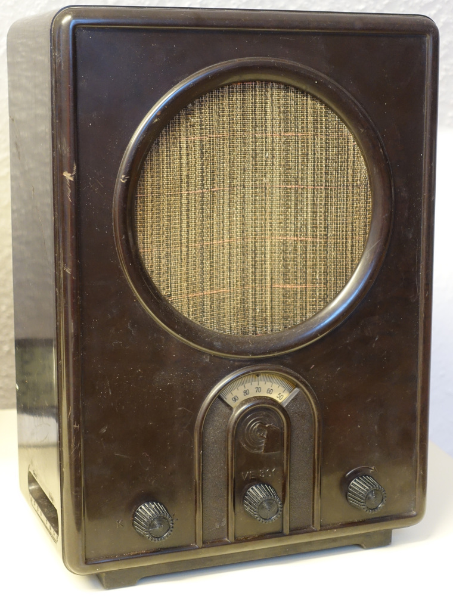
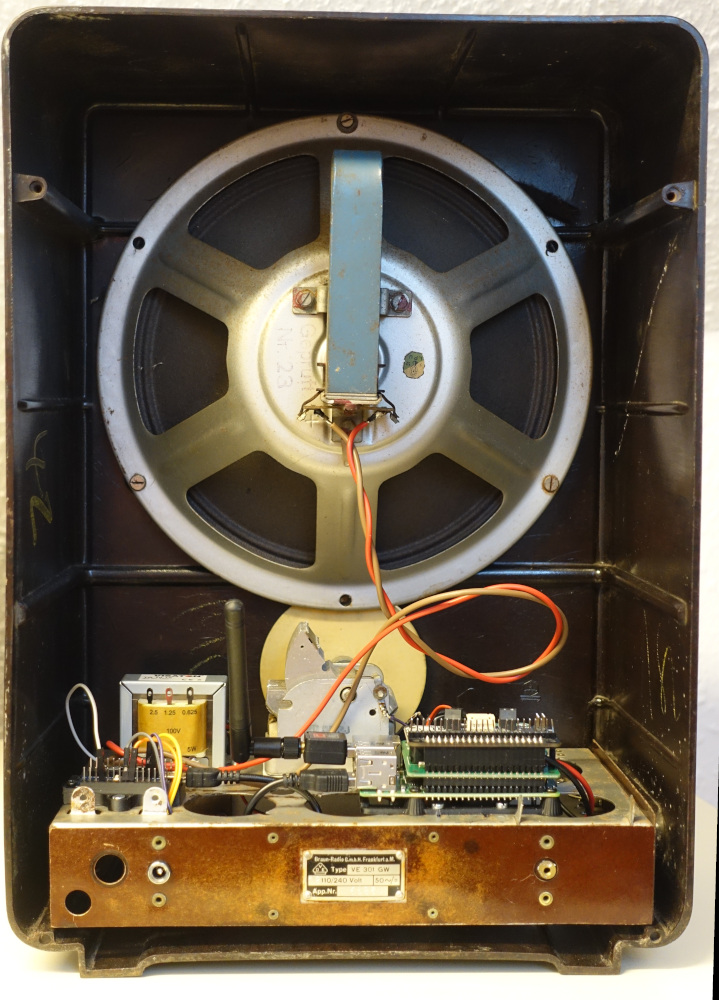
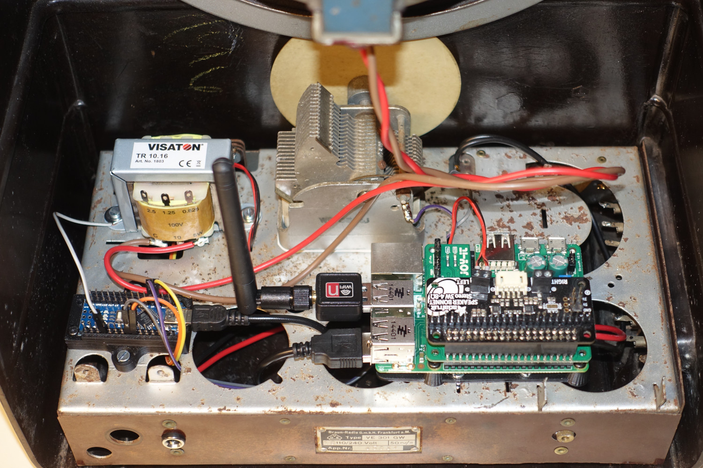
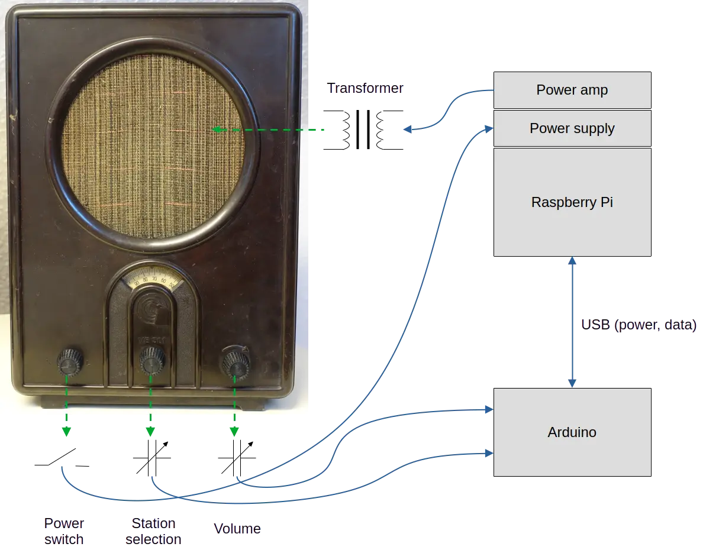
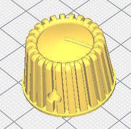

# VE301 tube radio retrofit

### What is a VE301?
The VE301 was a tube radio introduced in 1933 as part of Germany’s "Volksempfänger" (People’s Receiver) program. Designed by Otto Griessing, it was an affordable and simplified radio aimed at mass production to increase radio accessibility. Named after January 30, 1933—the day Hitler was appointed Chancellor—the VE301 became a tool for Nazi propaganda, ensuring state-controlled broadcasts reached millions. Built with minimal components, it had limited reception to favor domestic stations. Despite its political use, the VE301 remains a historical artifact representing early mass media influence and mid-20th-century radio engineering.

More details at Wikipedia: https://en.wikipedia.org/wiki/Volksempf%C3%A4nger

## Why to retrofit it?
One key motivation for this retrofit was to show children how old radios sounded and looked. To preserve the historical charm of the VE301 while making it usable again, I removed the original vacuum tubes and installed a Raspberry Pi and a Arduino for internet radio streaming. My goal was to retain as many original components as possible—I repurposed the variable capacitors for station selection and volume and kept the loudspeaker for authentic sound. Since AM and longwave broadcasts are no longer available in Germany, original VE301 radios no longer work. This retrofit keeps history alive. I firmly reject Nazi-era politics.

## Pictures

**Front view**



**Back view**



**Electronics view**



## System design



**List of electrical components**

| Part     | Product name | Product URL |
| -------- | ------------ | ----------- |
| Transformer  | Visatron TR 10.16 | https://www.visaton.de/de/produkte/ela/zubehoer/tr-1016  |
| Power amp | Adafruit I2S 3W Stereo Speaker Bonnet | https://www.adafruit.com/product/3346 | 
| Power supply    | Joy-IT StromPi 2   | https://strompi.joy-it.net/de/strompi-family |
| Raspberry Pi | Raspberry Pi 2 | https://www.raspberrypi.com/products/raspberry-pi-2-model-b/ |
| Arduino | Arduino nano | Various suppliers |


## 3D models

* VE301 Buttons
  
  Unfortunately, I damaged the original buttons while disassembling the radio thus I created some new 3D printed.
  
  
  
  - Fusion 360 file, see "3d/VE301 Drehknopf V3 v8.f3d"
  - STL file, see "3d/VE301 Drehknopf V3 v8.stl"


* [Arduino bracket](https://www.printables.com/de/model/588231-arduino-nano-bracket-mount)
* [Raspberry Pi mount](https://www.printables.com/de/model/296708-simple-raspberry-pi-mount-base-plate/files)

## Software

### Raspberry Pi

The Raspberry Pi drives is the main computer. It gets the audio stream from the Internet and plays it via the loudspeaker. Since the Pi doesn't have a ADC for variable capacitors measuring a additional Arduino is used.

**System preparation (tested with Raspberry OS)**
```
# Audio playing and text-to-speak
sudo apt install libmpv1 espeak-ng git
# Python
sudo pip install arduino-simple-rpc
sudo pip install python-mpv==0.5.2
```

**Clone repo**
```
mkdir src
cd src
git clone https://github.com/AlbrechtL/VE301-Retrofit.git
```

**Systemd service installation**
```
sudo cp ~/src/VE301-Retrofit/raspberry_pi/ve301_radio.service /etc/systemd/system/
sudo systemctl enable ve301_radio
```

### Arduino
The Arduino is used to interface the variable capacitors and provides the capacitors values via UART to the Raspberry Pi.

You can open the Arduino code with [PlatformIO](https://platformio.org/). Compile it and flash it to the Arduino. This project uses a Arduino Nano clone.

## Acknowledgements
I would like to thank the following open-source projects. Without these great works, this open-source switch would not be possible:  
- https://pypi.org/project/arduino-simple-rpc/


